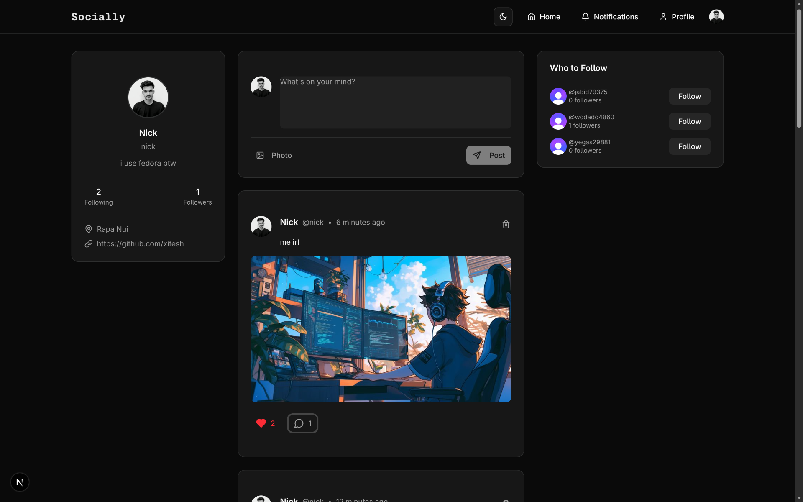
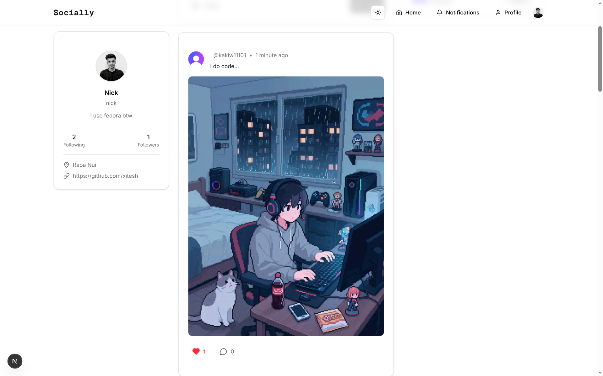

# 🌟 Socially

A modern, full-featured social media platform built with Next.js 15 and the latest web technologies. Share your thoughts, connect with friends, and express yourself through photos and posts.


## ✨ Features

- 🔐 **Secure Authentication** - Complete user management with Clerk
- 📝 **Create Posts** - Share text and images with your network
- 📸 **Image Uploads** - Seamless image sharing powered by UploadThing
- 👤 **User Profiles** - Customizable profiles with bio and avatar
- 👥 **Follow System** - Connect with other users
- 🔔 **Real-time Notifications** - Stay updated with interactions
- 🌙 **Dark/Light Mode** - Comfortable viewing experience
- 📱 **Responsive Design** - Perfect on all devices
- ⚡ **Lightning Fast** - Built with Next.js 15 and Turbopack

## 🚀 Quick Start

### Prerequisites

- Node.js 18+
- npm, yarn, pnpm, or bun
- A database (PostgreSQL recommended)

### Installation

1. **Clone the repository**

   ```bash
   git clone https://github.com/xitesh/social-share-next.git
   cd social-share-next
   ```

2. **Install dependencies**

   ```bash
   npm install
   ```

3. **Environment Setup**

   Copy `.env.example` to `.env` and fill in your credentials:

   ```bash
   cp .env.example .env
   ```

   Required environment variables:

   ```env
   # Clerk Authentication
   NEXT_PUBLIC_CLERK_PUBLISHABLE_KEY=your_clerk_publishable_key
   CLERK_SECRET_KEY=your_clerk_secret_key

   # Database
   DATABASE_URL=your_database_url

   # UploadThing (for image uploads)
   UPLOADTHING_TOKEN=your_uploadthing_token
   ```

4. **Database Setup**

   ```bash
   npx prisma generate
   npx prisma db push
   ```

5. **Start Development Server**

   ```bash
   npm run dev
   ```

   Open [http://localhost:3000](http://localhost:3000) to see your app! 🎉

## 🛠️ Built With

- **Framework**: [Next.js 15](https://nextjs.org/) - The React framework for production
- **Styling**: [Tailwind CSS v4](https://tailwindcss.com/) - Utility-first CSS framework
- **Authentication**: [Clerk](https://clerk.dev/) - Complete user management
- **Database**: [Prisma](https://prisma.io/) - Next-generation ORM
- **File Uploads**: [UploadThing](https://uploadthing.com/) - File uploads for Next.js
- **UI Components**: [shadcn/ui](https://ui.shadcn.com/) - Beautifully designed components
- **Icons**: [Lucide React](https://lucide.dev/) - Beautiful & consistent icons
- **Notifications**: [React Hot Toast](https://react-hot-toast.com/) - Smoking hot notifications

## 🎯 Usage

1. **Sign Up/Login** - Create your account or sign in
2. **Complete Profile** - Add your bio and profile picture
3. **Create Posts** - Share your thoughts and photos
4. **Discover Users** - Find and follow interesting people
5. **Engage** - Like, comment, and interact with posts
6. **Stay Updated** - Check notifications for new interactions

## 📱 Screenshots

### 🌙 Dark Mode



### ☀️ Light Mode



## 🚀 Deployment

### Deploy on Vercel (Recommended)

1. Push your code to GitHub
2. Connect your repository to [Vercel](https://vercel.com)
3. Add your environment variables in Vercel dashboard
4. Deploy! 🎉

### Environment Variables for Production

Make sure to set all environment variables in your deployment platform:

- Clerk keys for authentication
- Database URL for data persistence
- UploadThing token for file uploads

## 🤝 Contributing

Contributions are welcome! Please feel free to submit a Pull Request.

## 📄 License

This project is licensed under the MIT License - see the [LICENSE](LICENSE) file for details.

## 🙏 Acknowledgments

- Thanks to the Next.js team for an amazing framework
- Clerk for seamless authentication
- UploadThing for easy file uploads
- The open-source community for amazing tools and libraries

---

**Made with ❤️ by [Nick](https://github.com/xitesh)**

_Star ⭐ this repository if you found it helpful!_
